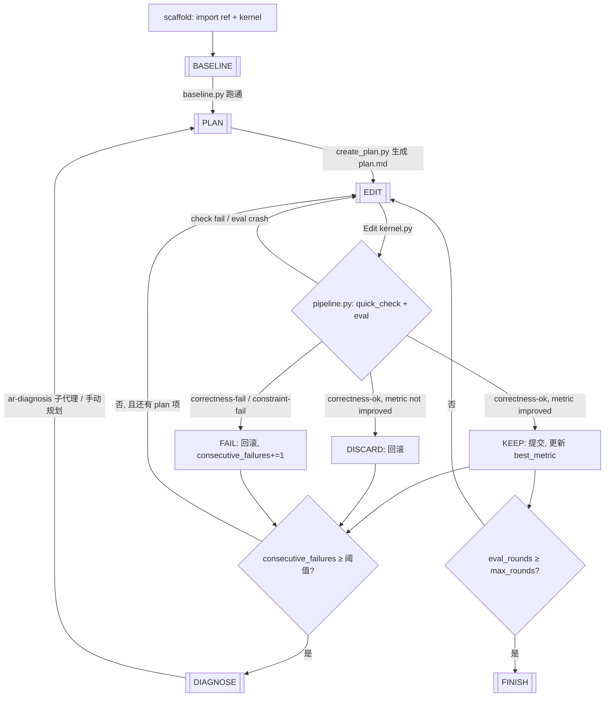
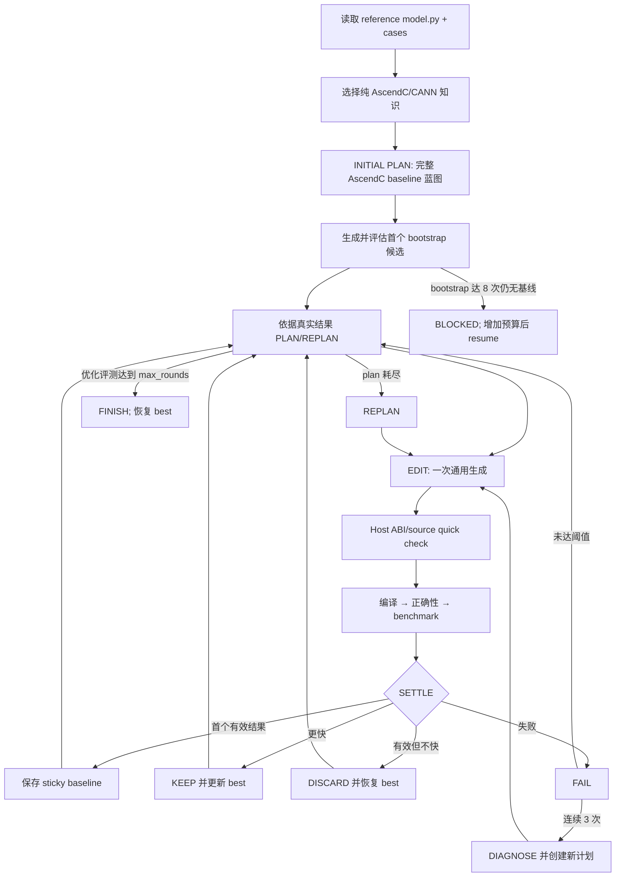

# AscendOpGenAgent

[](LICENSE)

中文 | [English](README.en.md)

**AscendOpGenAgent** 是一个面向 Ascend NPU 的自动化算子生成、评测与多轮优化框架。项目基于 Triton 与 AscendC 自动生成并验证高性能算子代码，并提供三套执行路径：Claude Code 交互式单算子生成、Claude Code 驱动的 AutoResearch 多轮迭代优化、以及直接调用 DeepSeek/OpenAI Chat Completions 接口的 AscendC 多轮生成器。

> **关于 Claude 的角色**：本项目不是"Claude 套壳"。AutoResearch 的多轮状态机、阶段机、评测、KEEP/DISCARD 判定和文件约束全部由本仓库的 Python 代码（`autoresearch/scripts/`）实现，Claude Code 在其中扮演 **LLM agent runtime**（负责 plan/edit/diagnose 的推理），并由 Claude Code hooks 触发状态机推进。`ascendc_multi_turn` 路径完全不依赖 Claude Code，当前明确支持 DeepSeek 和 OpenAI。详见「架构」。

## 目录

- [AscendOpGenAgent](#ascendopgenagent)
  - [目录](#目录)
  - [核心功能](#核心功能)
  - [架构](#架构)
    - [执行入口概览](#执行入口概览)
    - [Three execution paths](#three-execution-paths)
    - [AutoResearch 阶段机（多轮 Agent Framework）](#autoresearch-阶段机多轮-agent-framework)
    - [AscendC 多轮生成器流程](#ascendc-多轮生成器流程)
  - [Claude 的真实位置](#claude-的真实位置)
  - [快速开始](#快速开始)
    - [1. 环境要求](#1-环境要求)
    - [2. 安装与配置](#2-安装与配置)
    - [3. 使用场景指南](#3-使用场景指南)
      - [**3.1 Triton**](#31-triton)
      - [**3.2 AscendC**](#32-ascendc)
      - [**3.3 AutoResearch 多轮迭代优化**](#33-autoresearch-多轮迭代优化)
  - [评测基线](#评测基线)
  - [项目结构](#项目结构)
  - [单用例多 Shape 支持](#单用例多-shape-支持)
  - [许可证](#许可证)

## 核心功能

| 算子类型 | 模块 | 定位 | 核心能力 |
|------|------|------|----------|
| **Triton** | **triton-ascend-coder Agent** | 单算子交互式生成 | 任务提取 → 代码生成 → 评测验证（精度对齐与性能测试） |
| **Triton** | **Benchmark-Evaluator** | 一键批量评测 | 执行指定 Benchmark 评测，自动总结并生成详细报告 |
| **AscendC** | **ascend-kernel-developer Agent** | AscendC 单算子交互式生成 | 代码生成 → 评测验证（精度对齐与性能测试） |
| **AscendC** | **Ascend-Benchmark-Evaluator** | AscendC 算子一键批量评测 | 执行指定 Benchmark 评测，自动总结并生成详细报告 |
| **Triton** | **AutoResearch** | 多轮迭代性能优化 | plan → edit → eval → keep/discard 闭环，由 Python 阶段机强约束，Claude Code 提供 agent runtime |
| **AscendC** | **ascendc_multi_turn** | 直接 LLM 多轮生成（不依赖 Claude Code） | AscendC knowledge → PLAN → generate → evaluate → select 闭环，Python 状态机实现 KEEP/DISCARD、token 统计与断点续跑 |

> **共享内核**：Triton 单算子 Agent 与 Benchmark-Evaluator 底层共用同一个代码生成 Agent 工作流（`agents/triton-ascend-coder.md` + `skills/triton/`），统一处理「代码生成 → 验证 → 性能测试」的核心流程，保证生成逻辑一致性与复用。

## 架构

### 执行入口概览

```
User
 └─ 选择入口
    ├─ (A) Claude Code 交互式 ─ agents/triton-ascend-coder.md 或 ascend-kernel-developer.md
    ├─ (B) AutoResearch         ─ autoresearch/ 自包含子目录（cd && claude + hooks）
    └─ (C) AscendC 直接 LLM     ─ python -m ascendc_multi_turn
```

### Three execution paths

**(A) 交互式单算子生成（Triton / AscendC）**

把 `agents/*.md` 与 `skills/*` 装进 `.claude/`，在 Claude Code 中按提示词生成单个算子：
`任务提取 → 算法设计 → 代码生成与验证（迭代） → 性能优化与验证（迭代） → 输出报告`。

**(B) AutoResearch 多轮迭代优化（Agent Framework）**

`autoresearch/` 是一个自包含子目录，运行在 Claude Code 里，借助 Claude Code hooks（`PreToolUse` / `PostToolUse` / `Stop`）驱动一个由 `autoresearch/scripts/` 实现的阶段机。它解决"拿着已有正确 kernel + 参考实现，围绕可测量指标做多轮性能优化"的问题，支持批量跑、断点续跑、远端 NPU worker 与失败自动诊断。

**(C) AscendC 直接 LLM 多轮生成**

`ascendc_multi_turn/` 是一个独立的 Python 包，显式实现 `AscendC knowledge → initial PLAN → EDIT → eval → KEEP/DISCARD/FAIL → DIAGNOSE/REPLAN` 循环，复用仓库的 AscendC 工具链。它不调用 Claude Code，也不生成或转换 TileLang 中间实现，通过同一 Chat Completions 客户端连接 DeepSeek 或 OpenAI。详见 [docs/ascendc-direct-llm.md](docs/ascendc-direct-llm.md)。

### AutoResearch 阶段机（多轮 Agent Framework）

核心阶段循环（phase 常量与转移规则见 `autoresearch/scripts/phase_machine/`)：

```text
scaffold(import ref+kernel) → BASELINE → PLAN → EDIT ⇄ eval → KEEP/DISCARD
                                            │        │
                                            ▼        ▼
                                        (连续失败≥阈值) DIAGNOSE → 新 PLan
                                            │
                                            ▼
                                      eval_rounds ≥ max_rounds → FINISH
```



关键实现位置：

- **阶段机 / 状态机**：`phase_machine/phase_policy.py:595`（`compute_next_phase`）、`phase_machine/phase_policy.py:619`（`compute_resume_phase`）、`workflow/transition.py`（`PhaseController`）。
- **单轮结算（KEEP/DISCARD/FAIL）**：`workflow/round.py:29`（`record_round`）——正确性门 → 约束门 → 主指标存在 → 是否改善（`is_improvement`），决定 ROUND 走 KEEP / DISCARD / FAIL。
- **状态保存**：`phase_machine/state_store.py` —— 单一 `state.json`（`<task_dir>/.ar_state/state.json`）是控制面唯一事实源，原子写入 state.json 即事务提交；`history.jsonl` 为追加式的逐轮记录；`plan.md` 为 agent 面向的 plan。
- **每轮编排**：`engine/pipeline.py`（quick_check → eval → record_round → settle）。
- **eval 链路**：`task_config/`（loader / eval_client / eval_assemble）+ `utils/eval_runner.py`。支持本地 NPU，也支持走远程 HTTP worker（`worker/server.py`，`ar_cli.py` 管理 daemon 与 `ssh -L` tunnel）。
- **工具/文件约束**：hooks 通过 `phase_policy.check_bash` / `check_edit` 限制 Bash 命令形态与可写文件范围（`hooks/guard_bash.py`、`guard_edit.py`），保证 `.ar_state/` 只能被脚本/状态机写入，不能被模型手改。
- **终止条件**：`eval_rounds >= max_rounds` 是唯一合法 FINISH 触发；`consecutive_failures >= 阈值` 进入 DIAGNOSE；DIAGNOSE 后回到新 plan。过早 Stop 被 `hooks/stop_save.py` 拦截（只有 FINISH 阶段允许 Stop）。

该子系统的完整文档见 [autoresearch/AUTORESEARCH.md](autoresearch/AUTORESEARCH.md)。

### AscendC 多轮生成器流程

`ascendc_multi_turn/` 由 `MultiTurnRunner` 实现显式 Python 状态循环，完全不依赖任何 agent runtime：



关键实现位置：

- **评测预算**：`--max-bootstrap-rounds` 默认 8，约束建立正确且已测速基线的候选；`--max-rounds` 只约束基线后的性能候选；可选的 `--max-total-rounds` 为两阶段设置统一候选总数上限。
- **直接规划**：首个候选生成前先创建一个完整 AscendC baseline 计划，覆盖算法、tiling、内存搬运、dtype/尾块和 Host ABI；不使用 TileLang、DSL 中间实现或源码转换。后续计划再依据真实评测证据生成 3–5 个独立实验项。
- **每轮输入**：`prompts.py` 把 `reference_code + cases + current(FileBundle) + previous_result(EvalResult)` 组装进 prompt；同一轮 PLAN 和 generator 复用已选择的 AscendC 知识。
- **SETTLE**：基线前失败为 FAIL；基线后更快为 KEEP、有效但不快为 DISCARD、无效为 FAIL。连续三次 FAIL 进入 DIAGNOSE。
- **文件协议与安全**：固定模板先生成 CMake、dispatcher 注册、公共声明和目录；模型只能补全 `model_new_ascendc.py`、kernel、tiling、host 与 torch 接入五个逻辑文件。`bundle.py` 阻止绝对路径、`..` 穿越、固定文件修改和 build 文件，并拒绝旧 PyBind ABI。
- **评测反馈**：先校验 CANNBot 工程目录、ASC CMake、PyTorch dispatcher、PrivateUse1/Meta 和 `ModelNew → torch.ops`，再执行项目构建、正确性 profile 和包内独立 benchmark；正式时延由 `torch.npu.Event` 测量，几何平均 speedup 作为分数，仓库级 `skills/` 不参与该执行链。
- **知识控制**：只使用固定提交的 CANNBot 文本技能与 Asc DevKit 9.1.0 离线检索，按 `docs/api → examples → include → impl` 注入带版本、commit 和路径的文本证据；不存在旧结构化知识或模式回退。完整运行方法见 [AscendC 多轮算子生成与优化](ascendc_multi_turn/README.md)，架构方案见 [9.1.0 执行方案](docs/ascendc-agent-architecture-plan.md)。
- **状态保存**：phase、plan、双预算、pending checkpoint、baseline 和 best 均持久化；EVAL 环境失败后 resume 直接重评候选，不重复调用模型。
- **终止与退出**：无基线且 bootstrap 用尽为 `blocked`，不创建 DONE；完成全部性能轮才为 `completed`。

## Claude 的真实位置

- **交互式单算子生成（路径 A）**：Claude Code 就是完整 agent，负责任务提取、代码生成、迭代修复 —— 这是"Claude 为主"的模式，但仓库提供了结构化的 `agents/*.md` 定义和 `skills/*` 知识库，并非裸 prompt。
- **AutoResearch（路径 B）**：**Claude Code 是 agent runtime / LLM 后端**，负责 plan / edit / diagnose 的推理；而**多轮迭代控制、阶段机、状态、评测、KEEP/DISCARD、失败诊断、终止判定全部由 `autoresearch/scripts/` 的 Python 实现**。Claude Code 通过 hooks（`.claude/settings.json` 触发 `hooks/guard_*` 与 `hooks/post_*`）被约束在一个由本项目状态机定义的工作流中。因此这部分**不是"几个 Claude prompt + skills"的套壳**，而是一个有独立状态机的 Agent Framework，Claude 只是其中执行 LLM 推理的后端。
- **AscendC 多轮生成器（路径 C）**：**完全不涉及 Claude**。多轮循环、状态、KEEP/DISCARD、评测、token 统计全在 `ascendc_multi_turn/` 的 Python 代码里，LLM 侧可选 DeepSeek（默认）或 OpenAI。

## 快速开始

### 1. 环境要求

在运行本项目之前，请确保您的环境满足以下要求：
- Python 3.10+（AutoResearch 要求，见 `autoresearch/requirements-worker.txt`）
- Ascend CANN + NPU（`npu-smi info` 可列出设备，Arch Ascend 910B 系列）
- Triton Ascend + PyTorch 2.0+
- Claude Code CLI（用于路径 A / B，路径 C 不需要）
- tilelang-ascend（参考 https://github.com/tile-ai/tilelang-ascend/blob/ascendc_pto/README.md#method-3-compile-and-install-from-source 安装，供 AscendC/TileLang 路径使用）

### 2. 安装与配置

```bash
git clone https://github.com/your-repo/AscendOpGenAgent.git
cd AscendOpGenAgent
```

- **交互式生成 / 批量评测（路径 A）**：把对应 Agent 和 skills 装进项目的 `.claude/`（见各场景小节）。
- **AutoResearch（路径 B）**：直接进入 `autoresearch/`，其中已带好 `.claude/{settings.json,agents,commands}` 与顶层 `CLAUDE.md`，无需再配置。
- **AscendC 直接 LLM（路径 C）**：在 `.env` 中选择 DeepSeek 或 OpenAI 并设置对应 API key，无需 Claude。

### 3. 使用场景指南

#### **3.1 Triton**

##### 场景一：单算子生成

1. 在 AscendOpGenAgent 目录下配置 Agent 和 skills：
```bash
mkdir -p .claude/skills
mv agents/triton-ascend-coder.md .claude/CLAUDE.md
mv skills/triton/* .claude/skills/
```

2. 启动 claude：
```bash
claude
```

3. 输入算子生成 Prompt：
```text
生成一个基于 Triton-Ascend 框架的 softmax 算子实现。目标设备架构为 ascend910b1，请将生成的代码文件输出至 /path/to/output/ 目录下。
```

**执行流程**：Agent 自动执行 Phase 0-5：参数确认 → 任务构建 → 算法设计 → 代码生成与验证（迭代） → 性能优化与验证（迭代） → 输出报告。

##### 场景二：Benchmark 批量评测

支持两种输入模式：
- **标准模式**：使用 KernelBench（PyTorch Model）
- **GPU 迁移模式**：使用 `benchmarks/TritonNPUKernelBench`（GPU Triton Code → NPU Triton Code）

**子模式 A：标准模式（KernelBench）**

配置 `.claude/`（同场景一），再执行批量调度脚本：

单 NPU 串行：
```bash
bash utils/run_benchmark_triton.sh \
    --benchmark-dir /path/to/KernelBench \
    --level 1 --range 1-30 --npu 0 --output /path/to/output
```

多 NPU 并行（推荐）：
```bash
bash utils/run_benchmark_triton.sh \
    --benchmark-dir /path/to/KernelBench \
    --level 1 --range 1-30 --npu-list "0,1,2,3,4,5" --output /path/to/output
```

参数：`--benchmark-dir`(必填)、`--level`(必填，1-4)、`--range` 或 `--ids`（二选一）、`--npu` 或 `--npu-list`（互斥）、`--output`(必填)。

**子模式 B：GPU Triton Code → NPU（TritonNPUKernelBench）**

将 `{op_name}.pt`（含 `input_data`、可选 `gpu_output`）与 `vllm_gpu_perf.csv` 上传到 `benchmarks/TritonNPUKernelBench/`，配置 `.claude/` 后启动 claude 并输入：
```text
生成triton算子，
描述文件路径：benchmarks/TritonNPUKernelBench/${算子}.py，
arch是 ascend910b2，ASCEND_RT_VISIBLE_DEVICES=1
输出目录是 /path/to/output
```

Agent 会自动检测 TritonNPUKernelBench 路径并进入 **GPU Kernel 输入模式**，对比 NPU 实现与 GPU 基线性能（`report.md` 额外显示 "GPU 参考性能"）。

#### **3.2 AscendC**

##### 场景一：单算子生成（ascend-kernel-developer Agent）

1. 配置 Agent 和 skills：
```bash
mkdir -p .claude/skills
mv agents/ascend-kernel-developer.md .claude/CLAUDE.md
mv skills/ascendc/* .claude/skills/
```

2. 启动 claude：
```bash
claude
```

3. 输入算子生成 Prompt：
```text
生成一个基于 AscendC 框架的 softmax 算子实现。目标设备架构为 ascend910b2，请将生成的代码文件输出至 /path/to/output/ 目录下。
```

**执行流程**：Agent 自动执行：确认参数 → 提取任务描述 → 生成代码 → 验证精度与性能 → 输出最终报告。

##### 场景二：Benchmark 批量评测（Ascend-Benchmark-Evaluator）

配置 `.claude/`（同场景一），再执行批量调度脚本：

单 NPU 串行：
```bash
bash utils/run_benchmark_ascendc.sh \
    --benchmark-dir /path/to/NPUKernelBench \
    --level 1 --range 1-30 --npu 0 --output /path/to/output
```

多 NPU 并行（推荐）：
```bash
bash utils/run_benchmark_ascendc.sh \
    --benchmark-dir /path/to/NPUKernelBench \
    --level 1 --range 1-30 --npu-list "0,1,2,3,4,5" --output /path/to/output
```

> 底层 batch 调度脚本通过 `claude --print` 无头模式调用 agent（需要配置 `ANTHROPIC_AUTH_TOKEN` / `ANTHROPIC_BASE_URL`，见 `utils/run_benchmark_*.sh` 顶部注释）。

##### 场景三：AscendC 直接 LLM 多轮生成（不依赖 Claude Code）

`ascendc_multi_turn/` 是独立于 Claude 的 AscendC 多轮生成器。`--mock` 可在无 NPU 时验证编排流程。

DeepSeek 示例：
```bash
pip install -r requirements.txt
cp .env.example .env
# 编辑 .env，填写 DEEPSEEK_API_KEY
python -m ascendc_multi_turn \
  --op-name gelu \
  --op-file benchmarks/NPUKernelBench/level1/1_GELU.py \
  --output-dir outputs/1_GELU \
  --provider deepseek \
  --model deepseek-flash \
  --base-url https://api.deepseek.com \
  --max-bootstrap-rounds 8 --max-rounds 5 --max-total-rounds 5 \
  --soc-version Ascend910B3 --device 0
```

使用 OpenAI/GPT 测试时，在 `.env` 填写 `OPENAI_API_KEY`、`OPENAI_MODEL`、
`OPENAI_BASE_URL`，并改用 `--provider openai`。直调流程使用固定的 CANNBot 文本技能和
Asc DevKit 9.1.0 离线证据；首轮先复制固定工程模板，再让 LLM 补全五个算子逻辑文件并评测。
命令默认在 stderr 显示当前轮次、各阶段和每 15 秒心跳，stdout 只保留最终
JSON；需要静默运行时增加 `--quiet`。每轮完整的静态检查、编译、正确性与性能
输出保存在 `.llm_state/round_NN/*.log`，最终 JSON 的 `failure.details_path` 会指向
失败阶段日志。

代码生成使用 65536 token 且默认关闭 thinking；PLAN/DIAGNOSE 独立使用 8192 token 并默认关闭
thinking，避免推理耗尽完整代码的输出预算。可用 `--generator-thinking enabled` 显式开启生成器思考。
旧 `--repair-*` 参数暂时接受但已弃用，不再触发额外 repair 调用。默认
`--reasoning-log full` 会把 API 返回的原始 reasoning 以权限 `0600` 保存到对应轮次目录，
`calls.jsonl` 只记录路径、长度与哈希；使用 `--reasoning-log metadata` 可仅保留元数据。
API、知识选择或本地环境失败会停在当前 checkpoint，`--resume` 不会浪费候选轮。

诊断 DeepSeek 模型路由、thinking 行为和真实 Generator Prompt：

```bash
python -m ascendc_multi_turn.llm_diagnostic \
  --prompt-file /path/to/.llm_state/round_01/prompt.txt \
  --output-dir outputs/deepseek_diagnostic \
  --model deepseek-flash
```

诊断会查询 `/models`，执行小型 thinking 开关对照，并分别用有界思考和非思考模式重放真实 Prompt；
不会应用或构建生成的候选。reasoning 可能包含源码或 Prompt 摘录，属于本地敏感审计产物，不得提交。

无 NPU 验证编排：
```bash
python -m ascendc_multi_turn \
  --op-name gelu \
  --op-file benchmarks/NPUKernelBench/level1/1_GELU.py \
  --output-dir /tmp/ascendc-flow-check --max-rounds 3 --mock
```

详见 [docs/ascendc-direct-llm.md](docs/ascendc-direct-llm.md)。

#### **3.3 AutoResearch 多轮迭代优化**

适用于已有 ref 和种子 kernel、需要围绕性能指标做长时间多轮迭代的场景。整套阶段机由仓库 Python 代码实现，Claude Code 提供 agent runtime。

1. 进入 AutoResearch 自包含子目录并启动 claude：
```bash
cd autoresearch
claude
```

2. 输入算子优化命令（把 `<op>` 换成你的算子名，先放 `workspace/<op>_ref.py` 与 `workspace/<op>_kernel.py`）：
```text
/autoresearch --ref workspace/<op>_ref.py --kernel workspace/<op>_kernel.py \
  --op-name <op> --devices 5 --max-rounds 30
```

3. 本机无 NPU 时，可把 eval 转发到远端 Ascend 机器。在 `autoresearch/config.yaml` 的 `remote_worker.hosts` 加一个 host alias 后：
```bash
# 启远端 worker daemon + 自动 ssh -L tunnel（cleanup 用 --stop 同理）
python scripts/ar_cli.py worker --remote-host my-npu --start \
    --backend ascend --devices 0 --port 9111

# /autoresearch 加 --worker-url 即透明走远端
/autoresearch --ref ... --kernel ... --devices 0 --worker-url 127.0.0.1:9111
```

批量跑、断点续跑、阶段机不变量、远程 worker 细节见 **[autoresearch/AUTORESEARCH.md](autoresearch/AUTORESEARCH.md)**。

## 评测基线

- **Triton / AscendC**：请参阅 [`benchmarks/BASELINE_latest.md`](benchmarks/BASELINE_latest.md)（另有按日期归档的 `BASELINE_0327.md` / `BASELINE_0408.md` / `BASELINE_0415.md` / `BASELINE_0420.md`）。

## 项目结构

```text
AscendOpGenAgent/
├── .gitignore
├── LICENSE
├── CONTRIBUTING.md
├── README.en.md
├── README.md
├── TODO.md
├── archive_tasks/               # 归档的算子任务产物（design/kernel 分层）
├── agents/                      # Agent 定义（Claude Code 交互式路径）
│   ├── ascend-kernel-developer.md
│   └── triton-ascend-coder.md
├── ascendc_multi_turn/          # 直接 LLM AscendC 多轮生成器（无 Claude 依赖）
│   ├── __main__.py / runner.py / bundle.py / evaluator.py
│   ├── llm.py (DeepSeek/OpenAI provider / Mock) / prompts.py / models.py
│   └── logging.py (TrajectoryLogger)
├── autoresearch/                # AutoResearch 自包含子目录（cd && claude 直接激活）
│   ├── CLAUDE.md                # 主 agent prompt
│   ├── AUTORESEARCH.md          # 完整操作系统文档
│   ├── config.yaml              # profiler / eval / remote_worker / thresholds
│   ├── .claude/                 # Claude Code 配置（提交进仓库）
│   │   ├── settings.json        #   hooks + 权限
│   │   ├── agents/ar-diagnosis.md
│   │   └── commands/autoresearch.md
│   └── scripts/                 # 框架运行时（Python）
│       ├── ar_cli.py            #   worker 子命令 + remote-host SSH 调度
│       ├── engine/              #   baseline / pipeline / create_plan / eval_kernel / parse_args / quick_check
│       ├── workflow/            #   round(record_round) / transition(PhaseController) / planning / baseline / progress_reducer
│       ├── hooks/               #   guard_* + post_* + stop_save（Claude Code hooks）
│       ├── phase_machine/       #   BASELINE / PLAN / EDIT / DIAGNOSE / REPLAN / FINISH + guidance / phase_policy / validators / state_store
│       ├── task_config/         #   task.yaml loader + eval_client（本地+远程 transport）+ package_builder
│       ├── worker/              #   FastAPI HTTP worker daemon (/api/v1/run、/api/v1/status)
│       ├── batch/               #   discover / prepare / run / monitor / summarize / verify
│       └── utils/               #   correctness / eval_runner / settings / git_utils / hw_detect / ...
├── benchmarks/
│   ├── KernelBench/             # level1-4（PyTorch Model 标准基准）
│   ├── NPUKernelBench/          # level0-4（NPU AscendC 基准）
│   ├── TritonNPUKernelBench/    # GPU Triton → NPU 迁移评测数据（{op}.pt / {op}.py / vllm_gpu_perf.csv）
│   └── BASELINE_*.md
├── docs/
│   └── ascendc-direct-llm.md    # AscendC 直接 LLM 多轮生成文档
├── skills/
│   ├── triton/                  # Triton-Ascend 知识库（SKILL.md + references）
│   │   ├── kernel-designer / kernel-generator / kernel-splitter / kernel-verifier
│   │   ├── latency-optimizer / op-task-extractor
│   └── ascendc/                 # AscendC 知识库
│       ├── ascendc-translator / tilelang-designer / case-simplifier
│       ├── performance-analyzer / trace-recorder
├── tests/
│   └── test_ascendc_multi_turn.py
└── utils/                       # 构建 / 验证 / 评测 / 批量调度
    ├── build_ascendc.py / verification_ascendc.py / verification_tilelang.py
    ├── performance.py / generate_report_dynamic.py / render_session.py
    ├── run_benchmark_triton.sh / run_benchmark_ascendc.sh / install_env_deps.sh
```

## 单用例多 Shape 支持

本框架支持在一个算子用例中定义多个 Shape 配置进行批量验证和性能评测，适用于需要测试算子在不同规模输入下的性能表现的场景。

### 输入规格（算子描述文件）

#### 单 Shape 格式（向后兼容）

```python
import torch
import torch.nn as nn

class Model(nn.Module):
    def __init__(self):
        super(Model, self).__init__()

    def forward(self, x: torch.Tensor) -> torch.Tensor:
        return torch.nn.functional.gelu(x)

def get_inputs():
    """返回单组输入，形式为 List[Tensor/...]"""
    return [torch.randn(128, 128, dtype=torch.float16)]

def get_init_inputs():
    """返回初始化参数列表"""
    return []
```

**规格说明**：
- `get_inputs()`: 返回 `List[Tensor/...]`，代表单组输入
- 适用于单一 Shape 场景
- `get_init_inputs()`: 返回 `__init__` 的初始化参数列表

#### 多 Shape 格式

```python
import torch
import torch.nn as nn

class Model(nn.Module):
    def __init__(self):
        super(Model, self).__init__()

    def forward(self, x: torch.Tensor, approximate='none') -> torch.Tensor:
        return torch.nn.functional.gelu(x, approximate=approximate)

# 多 Shape 配置列表
INPUT_CASES = [
    {'inputs': [{'dtype': 'float32', 'name': 'x', 'shape': [128, 128], 'type': 'tensor'},
                 {'dtype': 'str', 'name': 'approximate', 'type': 'attr', 'value': 'none'}]},
    {'inputs': [{'dtype': 'float32', 'name': 'x', 'shape': [256, 256], 'type': 'tensor'},
                 {'dtype': 'str', 'name': 'approximate', 'type': 'attr', 'value': 'tanh'}]},
    {'inputs': [{'dtype': 'float16', 'name': 'x', 'shape': [1024, 1024], 'type': 'tensor'},
                 {'dtype': 'str', 'name': 'approximate', 'type': 'attr', 'value': 'none'}]},
]

# 必须实现，返回 List[List[Tensor/...]]
def get_input_groups():
    """返回多组输入列表，每组对应一个 Shape 配置"""
    input_groups = []
    for case in INPUT_CASES:
        group = []
        for spec in case['inputs']:
            if spec['type'] == 'tensor':
                dtype = {'float16': torch.float16, 'float32': torch.float32}[spec['dtype']]
                group.append(torch.randn(*spec['shape'], dtype=dtype))
            elif spec['type'] == 'attr':
                group.append(spec['value'])
        input_groups.append(group)
    return input_groups

# 可选实现，用于向后兼容
def get_inputs():
    """返回单组输入，取第一组"""
    return get_input_groups()[0]

def get_init_inputs():
    """返回初始化参数列表"""
    return []
```

**输入规格说明**：

| 函数 | 返回类型 | 用途 | 必需 |
|------|---------|------|------|
| `get_input_groups()` | `List[List[Tensor/...]]` | 多 Shape 入口，每组对应一个测试配置 | ✅ 多 Shape 场景必需 |
| `get_inputs()` | `List[Tensor/...]` | 单 Shape 入口，返回第一组或单组输入 | 建议实现（向后兼容） |
| `get_init_inputs()` | `List[Any]` | `Model.__init__` 的初始化参数 | ✅ 必需 |

**输入配置字段说明**：

| 字段 | 类型 | 说明 |
|------|------|------|
| `dtype` | `str` | 数据类型：float16/float32/float64/bfloat16/int8/int16/int32/int64/bool |
| `shape` | `List[int]` | 张量形状，如 `[128, 256]` |
| `name` | `str` | 参数名称 |
| `type` | `str` | 类型："tensor"（张量）、"attr"（属性值）、"tensor_list"（张量列表） |
| `value` | `Any` | 当 `type="attr"` 时，属性值 |

### 输出规格（性能报告）

性能报告汇总字段（参见 `utils/performance.py` 生成逻辑）：

| 字段 | 类型 | 说明 |
|------|------|------|
| `op_name` | `str` | 算子名称 |
| `warmup` / `repeats` | `int` | 预热 / 正式测试次数 |
| `total_cases` / `passed_cases` / `failed_cases` | `int` | 测试的 Shape 数量与通过/失败用例数 |
| `nan_indices` / `inf_indices` / `zero_indices` / `negative_indices` / `none_indices` | `List[int]` | 各类异常 `s_i` 的 case_idx 列表（无异常时为 `[]`，不进入几何平均） |
| `framework` / `implementation` | `Dict` | PyTorch / 实现版本的 `avg_latency_ms` 与 `peak_memory_mb` |
| `speedup_vs_torch` | `float\|null` | **几何平均加速比** = `(∏ s_i)^(1/n)`（自 commit `8df1790` 起；仅对 status==pass 且 `s_i` 为有限正数的 Shape；全部异常时为 `null`） |
| `perf_method` | `str` | "profiler"（torch_npu.profiler）或 "fallback"（time.perf_counter 兜底） |
| `per_shape_results` | `List[Dict]` | 各 Shape 明细（含失败用例，`case_idx`/`input_desc`/`status`/`speedup_vs_torch`/`error_type`/`error_msg`） |

单 Shape / 多 Shape 的完整 JSON 示例与逐字段说明，见历史 README 与 `utils/performance.py`。多 Shape 的核心区别：

- `total_cases`：单 Shape 为 1，多 Shape ≥2。
- `framework.avg_latency_ms` / `implementation.avg_latency_ms`：各 Shape 算术平均的毫秒延迟。
- `speedup_vs_torch`：几何平均加速比，异常 Shape 不参与。

### 适用场景

1. **算子泛化性测试**：验证生成算子在多种输入规模下的正确性和稳定性
2. **性能趋势分析**：通过对比不同 Shape 的加速比，识别算子的优势和局限性
3. **AI 模型场景复现**：模拟真实模型中的典型输入 Shape 分布（如 LLM 的多种序列长度）
4. **自动 Benchmark 评测**：批量评测时自动覆盖多种 Shape，减少重复工作量

## 许可证

本项目采用 [Apache 2.0 License](LICENSE) 开源许可证。
