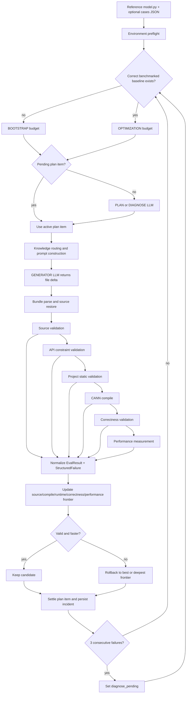
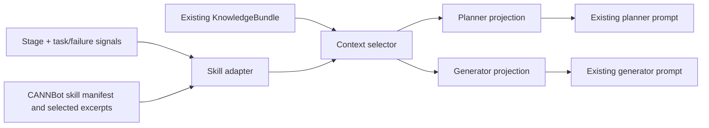

# CannAgent AscendC Agent analysis and CANNBot skill adaptation plan

## 2026-09-16 执行架构补充

生产评测已改为 `source validation → API validation → static validation → compile → smoke →
shape → dtype → full → benchmark`。每个 correctness profile 在独立子进程运行并即时写入逐 case
JSON；首个失败 profile 终止后续 profile。Runner 以七个规范门和已通过 profile/case 集判断单调
进展，仍以完整 Host/Kernel bundle 为原子接受单位。

首个被接受的已编译候选会生成确定性的 `InterfaceContract`。未显式声明
`allow_interface_change=true` 的计划不得改变 pybind 模块、`*_do` 声明/定义和 Kernel entry。
只修改注释或空白的非 mock 候选不会进入 evaluator，而会触发 DIAGNOSE。Prompt 保留完整参考
模型、完整用例和当前源码，但评测日志改为结构化摘要；知识模块按条目原子选择并受确定性预算约束。

## Scope and evidence

This analysis covers only `CannAgent/ascendc_multi_turn` and the embedded curated
CANNBot knowledge base under `knowledge_modules/cannbot_a08c4970_knowledge_base`. It does not propose
replacing the agent framework, evaluator, code generator, or workflow.

As of 2026-09-15, the knowledge base is the only production Skill source. The adapter
validates both manifests and every content hash once during Runner construction,
freezes the mapping and document registry, then performs in-memory selection. External
roots/mappings are migration errors; missing or modified knowledge module files fail fast.

The findings are based on the current source and on the checked-in GELU run at
`outputs/1_GELU/.llm_state`. That run is useful evidence, but it is one operator
and is not by itself an evaluation result for the proposed adapter.

## 1. Current Agent architecture

### 1.1 Components and roles

| Component / role | Implementation | Responsibility |
|---|---|---|
| Orchestrator | `runner.MultiTurnRunner` | Owns resume state, budgets, planning, editing, evaluation, frontier rollback, and termination. |
| Planner | LLM call type `planner` | Creates one complete bootstrap plan or 3–5 evidence-driven repair/optimization items. |
| Diagnoser | LLM call type `diagnose` | Uses the same plan prompt/JSON contract with a diagnosis-specific instruction after three consecutive failures. It is a mode of the planner, not an independent agent. |
| Generator/editor | LLM call type `generator` | Returns a JSON file delta for the Python wrapper, pybind host source, kernel source, and optional headers. |
| Document knowledge router | LLM call type `knowledge_router`, only in `document` mode | Selects a bounded working set of raw Markdown API documents. This is the legacy comparison path. |
| Structured knowledge router | `StructuredKnowledgeRouter` | Deterministically selects API cards/facts, failure cards, pattern cards, project contracts, and provenance from a published knowledge build. |
| Runtime header collector | `collect_runtime_facts` | Looks up exact symbols in installed public CANN headers and emits bounded excerpts in `document` mode. |
| Static/source validators | `validate_source_tree`, project static validator, `ApiConstraintValidator` | Reject invalid source layout, launch/ABI violations, and known API-constraint violations before compilation. |
| Evaluator | `LocalAscendEvaluator` | Runs source validation, API validation, static validation, clean build, correctness tests, then performance measurement. |
| Frontier/experience layer | `FrontierManager`, incident/experience persistence | Preserves the deepest working source frontier, rolls failed candidates back, and records confirmed experiences. |

There are multiple LLM roles, but there is no multi-agent handoff protocol. The
planner/diagnoser and generator receive prompts from the same runner and share
the same candidate/evaluation state.

### 1.2 End-to-end workflow



The practical compile/debug loop is therefore:

```text
plan item -> generate source delta -> deterministic checks -> clean compile
          -> correctness -> performance -> structured failure/fingerprint
          -> rollback/keep -> next plan item -> diagnose after 3 failures
```

There is no separate compile-repair LLM call. A compile or correctness failure
becomes evidence for the next plan/generator cycle.

### 1.3 Prompt construction

The provider supplies a short system prompt: act as an expert AscendC engineer
and return one JSON object. Nearly all behavior is specified in the user prompt.

Planner/diagnoser prompt sections:

1. purpose and execution rules;
2. global mandatory AscendC/project rules;
3. reference PyTorch model;
4. all supplied test cases;
5. the complete current implementation;
6. compact latest evaluation evidence;
7. one rendered knowledge context;
8. up to eight compact history records;
9. JSON plan output contract.

Generator prompt sections:

1. current objective and active plan item;
2. Host / Host↔Kernel boundary / Kernel failure ownership;
3. active evaluation profile, case indices/features, and diagnostic source files;
4. protected regions;
5. open and cleared errors plus only failed approaches relevant to open errors;
6. must-satisfy semantic and ABI contracts;
7. exact installed/Verified facts and routed embedded knowledge modules;
8. explicit forbidden patterns;
9. complete reference model, benchmark cases, current implementation, and evaluation;
10. JSON file-bundle output contract.

Embedded knowledge module sections are selected by stage/domain/profile and delivered atomically;
structured/runtime entries retain bounded/full-selected projection. The prompt records a
typed `input_route`, while the evaluated candidate records a separate
`result_failure_route` for the next iteration.

### 1.4 Knowledge retrieval and injection

#### Default `structured` mode

The offline build is well designed: official Markdown is normalized, facts and
cards retain provenance, builds are versioned, and exact API names are indexed.
At runtime the runner builds `KnowledgeContext` from:

- operator file stem;
- a coarse phase (`plan_generate` or `diagnose`);
- runtime/knowledge CANN versions and SoC;
- symbols extracted from the concatenation of reference model, cases, every
  current source file, and the previous full result log;
- optional structured failure and active plan item.

Routing behavior is hybrid and deterministic:

- API selection: exact symbol lookup only;
- API facts: rule-based API applicability filter;
- failure cards: token-set cosine score against failure signals;
- pattern cards: lexical token overlap, falling back to token-set cosine;
- project contracts: all contracts, every time.

Despite retrieval trace labels named `fts` and `vector`, the implementation does
not use a full-text search engine, embeddings, or semantic vector retrieval. The
“vector” fallback is cosine similarity over sets of regex-extracted tokens.

The entire resulting `KnowledgeBundle`, including context, metadata,
provenance, and all selected material, is JSON-rendered and truncated by one
global character cap. There is no planner/generator projection in the current
implementation, even though the README describes such a projection as a design
goal.

#### Optional `document` mode

The legacy path uses an LLM router for the initial or incremental document
selection. Its deterministic fallback scores exact API symbols, textual API
mentions, manifest symbols, and weak family matches. Selected documents are
maintained as a task-level working set. Each round renders:

- runtime header excerpts;
- every core document that fits;
- API document excerpts, up to the document and character limits;
- up to two supplements.

This path is primarily rule-based retrieval plus an LLM selector, not embedding
semantic search. It also uses one shared rendering for planning and generation.

### 1.5 Current bottlenecks

| Bottleneck | Evidence and impact |
|---|---|
| Coarse phase identity | Structured contexts use only `plan_generate` or `diagnose`. Compile repair, runtime diagnosis, precision diagnosis, baseline design, code generation, and optimization are not distinct retrieval stages. |
| Planner and generator receive the same knowledge | `_knowledge_context` is called before planning and its rendered string is reused by candidate generation. Different roles cannot receive different projections or budgets. |
| Over-broad evidence drives symbol extraction | Symbols come from reference code, all current files, cases, and full failure logs. Build-tool tokens and local class/function names are treated as candidate API symbols, creating noise and long traces. |
| Exact routing starts too late | On the first round there is no AscendC source, so exact API retrieval returns no cards/facts. The planner must invent an API set before exact retrieval can help it. Operator-family, algorithm, tiling, and hardware knowledge are therefore under-supplied at bootstrap. |
| Failure-card routing is fragile | Failure cards are selected by token overlap only. The GELU run selected zero failure cards in every round. Its last compiler log was also classified as `AICORE` because text matching occurs before the explicit compile-stage check, weakening debug routing. |
| Pattern selection is only lexical | Generic terms can select broad C/V or cross-core patterns unrelated to a simple vector operator. Pattern selection does not first classify the operator family. |
| Global character truncation is not priority-aware | `render_bundle` serializes a large JSON object and cuts the final string. A truncation can retain metadata/provenance while cutting actionable facts; no per-category quota guarantees hard constraints survive. |
| Repeated large context | In the checked-in GELU run, rounds 2–5 each produced a 60,000-character reference payload and roughly 83,000-character generator prompt. The knowledge selections were almost identical. |
| High cost without progress | That run spent 368,119 total tokens over five failed bootstrap evaluations and never compiled. This is a single-case observation, not a general benchmark, but it demonstrates the failure mode. |
| Template mismatch risk | CANNBot direct-invoke skills contain complete project scaffolds, CMake, scripts, and integration choices. Injecting a whole template would conflict with CannAgent's fixed file-bundle and host ABI contracts. |
| Authority is not explicit in the prompt | Installed headers, structured official facts, project contracts, CANNBot practices, examples, and prior experience are not presented as an ordered authority stack. Conflicts are harder for the model to resolve. |

## 2. CANNBot AscendC skill analysis

The skills should be treated as stage-addressable domain modules. Their
workflow instructions are not imported into CannAgent.

### 2.1 `ascendc-api-best-practices`

- Purpose: correct and efficient use of arithmetic, reduction, data movement,
  buffer, precision, pipeline, matmul/GMM, communication, synchronization, and
  atomic APIs.
- Trigger: an API is planned or present; a compile/constraint error names an
  API; alignment, repeat count, buffer ownership, or overload usage needs
  verification.
- Required input: exact API names, direction/overload, dtype, shape/alignment,
  CANN version, SoC, relevant source call, and compiler diagnostic.
- Expected artifact: a small API constraint checklist or a corrected call
  pattern tied to the exact call site.
- References: `api-quickref.md`; per-topic files such as
  `api-datacopy.md`, `api-buffer.md`, `api-pipeline.md`,
  `api-arithmetic.md`, `api-reduce*.md`, `api-precision.md`,
  `api-restrictions.md`, and architecture-specific advanced API guides.
- Templates/examples: API call examples, CopyIn/Compute/CopyOut patterns,
  batching for repeat limits, aligned/non-aligned data movement, buffer reuse,
  and pipeline synchronization examples.
- Knowledge type: verified constraints, best-practice patterns, anti-patterns,
  API examples.

### 2.2 `ascendc-tiling-design`

- Purpose: classify the operator and design core partitioning, UB tiling,
  buffer allocation/reuse, branch coverage, and boundary handling.
- Trigger: initial kernel design, a tiling/runtime failure, UB overflow,
  imbalance, or performance redesign.
- Required input: operator semantics/family, complete shape set, dtypes,
  reduction/broadcast axes, layout, target architecture, available UB/core
  values, alignment, and current tiling if one exists.
- Expected artifact: operator-family classification; block/core strategy; tile
  and tail formulas; UB budget; buffer lifetimes/reuse; tiling fields; branch
  matrix and boundary cases.
- References: family routers and design documents under `reduction/`, `sort/`,
  `elewise/`, `broadcast/`, `conversion/`, `matmul/`, and `flashattention/`.
- Templates/examples: reduction algorithms and tiling fields, elementwise and
  broadcast patterns, matmul/GMM tiling, sort merge schemes, FlashAttention
  shape/resource/execution decomposition.
- Knowledge type: algorithm selection, hardware-aware design rules, formulas,
  branch/test design.

### 2.3 `ascendc-direct-invoke-template`

- Purpose: provide validated direct-invocation project and kernel structure for
  Vector, Blaze Matmul, and Kirin targets.
- Trigger: initial direct-invoke implementation or a source/host/launch
  structure failure.
- Required input: operator family, target platform, I/O signature, dtype/shape
  coverage, invocation mode, and the host ABI imposed by CannAgent.
- Expected artifact: a complete source layout and direct kernel launch skeleton
  adapted to CannAgent's existing file contract.
- References: `references/add_custom/`, `matmul_blaze_template/`,
  `kirin_add_template/`, their guides, and `kernel_launch_details.md`.
- Templates/examples: Vector CopyIn/Compute/CopyOut, TPipe/TQue usage, host
  launch, tiling structures, PyTorch extension and test scaffolds, and Blaze
  matmul variants.
- Knowledge type: engineering templates, compilable examples, integration
  conventions.
- Adaptation boundary: do not inject/copy its CMake, run scripts, full directory
  scaffolds, module registration workflow, or target-specific files unless they
  match CannAgent's fixed evaluator and ABI. Prefer small structural excerpts.

### 2.4 `ascendc-runtime-debug`

- Purpose: diagnose nonzero ACL/ACNN returns, device exceptions, tiling/kernel
  lookup failures, environment problems, and plog evidence.
- Trigger: runtime error codes (not numerical mismatches), AICore/MTE exception,
  kernel-not-found, tiling failure, environment error, or plog content.
- Required input: error code, structured failure, concise plog/error excerpt,
  SoC/CANN version, failing case, launch/tiling values, and relevant source.
- Expected artifact: classified runtime fault, ranked checks, next minimal
  diagnostic action, and expected confirming signal.
- References: `debug_workflow.md`, `error_codes.md`,
  `kernel_binary_debug.md`; helper `scripts/parse_plog.py`.
- Templates/examples: error-code decision tree, 507035/MTE checks,
  kernel-binary/cache/SEL checks, environment inspection.
- Knowledge type: diagnostic playbooks, error taxonomy, commands/tools.

### 2.5 `ascendc-precision-debug`

- Purpose: diagnose numerical mismatch, zero/random/uninitialized output,
  dtype-specific error, cast behavior, synchronization, and data-movement
  correctness.
- Trigger: correctness comparison fails without a runtime fault; NaN/Inf/all
  zero; dtype-dependent mismatch; tolerance failure; suspected Cast/DataCopy or
  queue synchronization issue.
- Required input: failing/passing cases by dtype and shape, tolerances, error
  distribution, golden/output samples, kernel dataflow, buffer sizes, and
  synchronization points.
- Expected artifact: symptom classification, one testable root-cause hypothesis,
  minimal instrumentation/fix, and a pass/fail signal.
- References: `diagnosis-workflow.md`, `common-traps.md`,
  `data-comparison.md`, `ascendc-dumptensor.md`, `printf-debug.md`,
  `binary-search-debug.md`, `simt-precision-debug.md`, case studies, and summary
  template.
- Templates/examples: stable FP32 intermediate patterns, Cast round modes,
  CopyIn-to-CopyOut isolation, EnQue/DeQue synchronization, DumpTensor stages,
  and boundary-test generation.
- Knowledge type: diagnostic decision rules, numerical practices, instrumentation
  templates, test patterns.

### 2.6 `ascendc-performance-best-practices`

- Purpose: apply family-specific and common performance patterns after a
  correct measurable baseline exists.
- Trigger: performance optimization with a valid baseline and an identified
  bottleneck or requested technique.
- Required input: operator family, architecture, correct baseline source,
  per-case latency, shape/dtype distribution, tiling/buffer plan, and preferably
  profiler evidence.
- Expected artifact: one performance hypothesis, applicable constraints, small
  implementation delta, and expected metric movement.
- References: family guides for matmul, reduction, broadcast, conversion,
  elementwise, sort and SIMT; common tail-block, DataCopy, UB-resident, and
  core-shrink guides.
- Templates/examples: reduction and transpose templates, broadcast reference
  code, double buffering, vector efficiency, ping-pong/Stream-K/full-load and
  related design examples.
- Knowledge type: optimization patterns, selection trees, performance templates,
  empirical guidance.
- Safety boundary: never activate before correctness; never load every family or
  every optimization variant.

### 2.7 `npu-arch`

- Purpose: resolve chip/SocVersion/NpuArch mappings, architecture capabilities,
  buffer/core parameters, feature availability, and conditional compilation.
- Trigger: initial hardware planning, architecture-specific API/template
  selection, unknown SoC mapping, or an architecture compatibility failure.
- Required input: configured SoC, detected runtime CANN version, and any runtime
  NpuArch/SocVersion facts.
- Expected artifact: normalized architecture identity, capabilities/constraints,
  runtime-query requirements, and conditional branches if needed.
- References: `npu-hardware-params.md`, `npu-arch-guide.md`,
  `simt-arch-guide.md`, and the Triton-specific guide (not relevant to direct
  AscendC generation).
- Templates/examples: `PlatformAscendC` runtime queries, architecture macro
  mapping, buffer/core lookup, feature compatibility checklist.
- Knowledge type: hardware facts, compatibility rules, architecture patterns.

## 3. Adaptation design

### 3.1 Design decision

Add a thin, opt-in layer between current structured retrieval and prompt
construction:



The adapter is not a CANNBot workflow runner. It does not execute skill scripts,
copy template directories, ask another LLM to route, or mutate source. It only:

1. derives one or more fine-grained CannAgent stages;
2. applies deterministic mappings from `skill_mapping.yaml`;
3. selects complete sections from the validated in-memory knowledge module registry;
4. emits a typed, auditable context knowledge module;
5. lets the context selector merge that knowledge module with a stage projection of the
   existing structured knowledge.

### 3.2 Authority and conflict order

Prompts must state and preserve this order:

1. compiler/runtime/evaluator evidence from the current environment;
2. installed CANN public headers;
3. version-matched structured official facts;
4. CannAgent project contracts and fixed output/host ABI;
5. selected CANNBot best practices and templates;
6. confirmed local experience;
7. generic examples.

CANNBot content cannot override the fixed CannAgent host ABI, the current
headers, or an evaluator result.

### 3.3 Minimal implementation boundaries

In scope:

- `skill_adapter.py`: mapping loader, trigger evaluator, safe reference loader,
  heading extractor, audit metadata;
- `context_selector.py`: stage derivation, operator-family detection, per-role
  projection and budgets;
- existing `prompts.py`: accept a structured rendered context and label its
  audience/stages/authority;
- narrow runner/config wiring and unit tests required to activate the three
  components.

Out of scope:

- workflow changes or new agents;
- a new RAG/vector database;
- executing CANNBot scripts;
- copying full CANNBot projects;
- changing code-generation output format;
- changing evaluator order, frontier logic, or repair budgets;
- automatically editing knowledge builds.

### 3.4 Delivery sequence

1. Keep the adapter opt-in so the existing agent remains a true baseline.
2. Add deterministic stage derivation and audit files.
3. Embed curated CANNBot documents with manifests and select complete knowledge module sections.
4. Project current structured knowledge separately for planner and generator.
5. Add prompt labels and authority/exclusion instructions.
6. Run unit/mock orchestration tests.
7. Run a paired NPU evaluation on the same frozen operator/case set.

## 4. Evaluation plan

Use the same commit, model/provider parameters, temperature, CANN/SoC, device,
operator cases, round budgets, and clean output directories.

| Arm | Configuration |
|---|---|
| Baseline | Current `structured` mode, skill adapter disabled. |
| New | Current `structured` mode plus the skill adapter/context selector. |

Run at least three repeats per operator when LLM sampling is non-deterministic.
Report both per-operator values and aggregate values; do not replace failed runs
with retries outside the configured budget.

Metrics:

- compile success rate: operators with at least one compiled candidate / total;
- correctness rate: operators with at least one fully correct candidate / total;
- iterations: candidate evaluations to first compile and first correct baseline;
- token consumption: prompt, completion, total, cache hit/miss, split by planner,
  diagnose, and generator;
- final latency: evaluator performance result for the best correct candidate;
- supporting context metrics: injected characters by audience/stage, selected
  skill/reference IDs, and repeated-context ratio.

Gate the change on compile/correctness first. Performance comparisons are valid
only for operators where both arms produce correct candidates. The checked-in
GELU run provides baseline diagnostic evidence, but a new paired run is required
before claiming improvement.

## 5. Implementation validation status

The opt-in adapter implementation was validated locally after this design was
approved:

- 25 structured-knowledge tests passed;
- 86 repository tests passed, including 6 new adapter/selector/prompt tests;
- a one-round paired mock GELU run completed in both arms;
- the mock baseline used 9,352 total synthetic tokens, while the adapter arm used
  10,763 because the bootstrap stage intentionally added architecture, tiling,
  and template knowledge;
- bootstrap reference sizes were 4,146 characters for the shared baseline
  context versus 5,794 Planner / 8,142 Generator characters for the adapter;
- replaying the checked-in round-5 GELU compile failure through the selector
  projected the old 60,000-character knowledge payload to 6,240 Planner and
  8,791 Generator characters.

Mock compile/correctness values are orchestration checks only and are not evidence
that generated AscendC is correct. A real paired evaluation was not possible in
this container: `torch_npu` availability probing exceeded a 20-second bounded
timeout (`status=124`). Real compile success, correctness, iterations, device
latency, and production token deltas therefore remain an environment-dependent
evaluation step; no improvement claim is made from the mock run.
