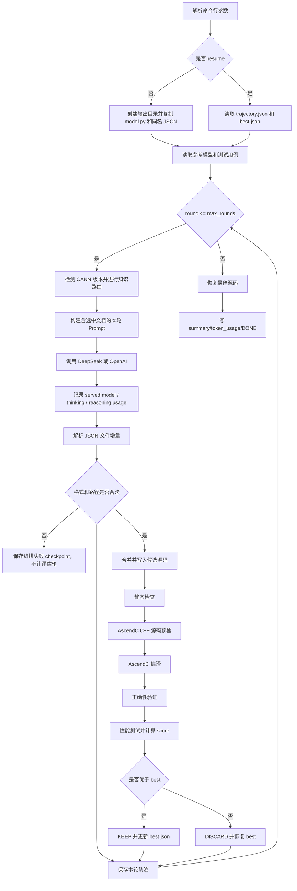

# CannAgent 非 Claude 执行流程分析

## 1. 结论摘要

CannAgent 包含三类执行路径：

| 执行路径 | 是否依赖 Claude Code | 用途 |
|---|---:|---|
| `agents/*.md` + `skills/*` | 是 | Triton / AscendC 单算子交互式生成 |
| `autoresearch/` | 是 | Triton 多轮性能优化；Python 负责状态机，Claude Code 负责推理与编辑 |
| `ascendc_multi_turn/` | 否 | 直接调用 DeepSeek/OpenAI 的 AscendC 多轮生成和优化 |

完全不使用 Claude Code 时，项目对应的执行入口是：

```bash
python -m ascendc_multi_turn
```

该路径是一套由 Python 显式实现的 `generate → evaluate → select` 循环，不依赖 Claude Agent SDK、Claude Code hooks、LangChain 或其他 Agent 框架。

核心判断如下：

- 已实现跨轮状态、上一轮反馈、最佳版本保存和断点续跑，可视为“短期工作记忆/工程状态记忆”。
- 没有 embedding、向量数据库、跨任务经验库等独立长期 Memory 系统。
- 初始实现只会全量注入三份固定 AscendC 文档；2026-09-05 起已升级为版本感知的 Skill/API 文档选择流程。
- 当前非 Claude 的完整直接 LLM 路径只覆盖 AscendC，没有发现对等的 Triton 直接 LLM 多轮入口。

## 2. 非 Claude 执行架构

主要模块如下：

| 模块 | 职责 |
|---|---|
| `ascendc_multi_turn/__main__.py` | 命令行入口、参数解析、Provider 和 Evaluator 选择 |
| `ascendc_multi_turn/runner.py` | 多轮主循环、KEEP/DISCARD、恢复与最终汇总 |
| `ascendc_multi_turn/llm.py` | DeepSeek/OpenAI `/chat/completions` 客户端 |
| `ascendc_multi_turn/knowledge.py` | CANN 版本检测、Skill/API 文档路由和受控上下文装载 |
| `ascendc_multi_turn/prompts.py` | 组合参考模型、用例、当前源码、反馈和知识文档 |
| `ascendc_multi_turn/bundle.py` | 解析模型返回、校验路径、写入和恢复源码 |
| `ascendc_multi_turn/evaluator.py` | 静态检查、编译、正确性验证和性能测试 |
| `ascendc_multi_turn/logging.py` | 轨迹、调用信息、token 和完成状态持久化 |
| `ascendc_multi_turn/models.py` | 配置、文件包、LLM 响应和评测结果数据结构 |

整体流程：



## 3. 启动与初始化

示例：

```bash
export DEEPSEEK_API_KEY=<API_KEY>

python -m ascendc_multi_turn \
  --op-file benchmarks/NPUKernelBench/level1/1_GELU.py \
  --output-dir outputs/1_GELU \
  --model deepseek-v4-flash \
  --base-url https://api.deepseek.com \
  --max-rounds 5 \
  --soc-version Ascend910B3 \
  --device 0
```

主要参数：

- `--op-file`：参考 PyTorch 模型文件。
- `--output-dir`：生成结果目录。
- `--provider`：选择 `deepseek` 或 `openai`。
- `--model`、`--base-url`：覆盖所选 Provider 的模型和服务地址。
- `DEEPSEEK_API_KEY` / `OPENAI_API_KEY`：按 Provider 从根目录 `.env` 加载，密钥本身不写入轨迹。
- `--max-rounds`：实际候选评估轮数上限；API、路由和环境失败不消耗该预算。
- `--device`、`--soc-version`：NPU 和编译目标配置。
- `--resume`：从已有 `.llm_state/trajectory.json` 继续。
- `--quiet`：关闭默认写入 stderr 的阶段进度、15 秒心跳和失败摘要；stdout 始终只输出最终 JSON。
- `--mock`：不调用 API、不编译、不使用 NPU，只验证编排流程。

新任务启动时，程序会：

1. 检查 `op-file` 是否存在。
2. 拒绝使用已有内容的非空输出目录，防止覆盖用户文件。
3. 将参考模型复制为 `<output-dir>/model.py`。
4. 如果参考模型旁存在同名 JSON，则一并复制到输出目录。

`--resume` 模式不会重新复制输入，只检查 `.llm_state/trajectory.json` 是否存在并恢复状态。

## 4. 每轮 Prompt 内容

每轮都会重新构建一个完整 Prompt，包含：

1. 参考 PyTorch 模型 `model.py`。
2. 同名 JSON 测试用例。
3. 当前完整 AscendC 实现。
4. 最近一轮 `EvalResult`，包括编译、正确性、性能和错误输出。
5. 由 `ascendc-translator` Skill 路由器选出的版本化 AscendC/CANN 资料：
   - `dsl2Ascendc.md`
   - `TileLang-AscendC-API-Mapping.md`
   - `AscendCVerification.md`
6. 模型必须遵守的 JSON 输出协议和文件约束。

LLM 请求是一个普通的 Chat Completions 请求：

```json
{
  "model": "<model>",
  "messages": [
    {"role": "system", "content": "You are an expert AscendC kernel engineer..."},
    {"role": "user", "content": "<完整的本轮 Prompt>"}
  ],
  "thinking": {"type": "enabled"},
  "reasoning_effort": "high",
  "max_tokens": 65536,
  "response_format": {"type": "json_object"}
}
```

知识路由默认关闭 thinking 并使用 4096 token；代码生成默认 high thinking、编译修复
默认 max thinking，二者上限均为 65536。thinking 模式不发送 temperature。客户端先
读取同级的 `reasoning_content`、`content`、usage 和 finish reason，因此 reasoning
耗尽预算导致的空正文不再退化为无法解释的 `LLM API returned empty content`。

每轮都是新的 API 请求，没有直接传递之前的 `messages[]` 会话。跨轮信息由 Python 将当前源码和最近一轮反馈重新放入 Prompt。

## 5. 模型输出与源码管理

模型必须返回一个 JSON 文件包：

```json
{
  "analysis": "简短说明",
  "files": [
    {"path": "model_new_ascendc.py", "content": "完整文件内容"},
    {"path": "kernel/pybind11.cpp", "content": "完整文件内容"},
    {"path": "kernel/my_kernel.cpp", "content": "完整文件内容"}
  ],
  "delete": ["kernel/obsolete.cpp"]
}
```

`files` 和 `delete` 是相对当前实现的增量，未出现的文件保持不变。程序会将增量和当前实现合并，再形成完整 candidate。

### 文件安全限制

允许修改：

- `model_new_ascendc.py`
- `kernel/` 下的 `.py`、`.cpp`、`.cc`、`.cxx`、`.h`、`.hpp`

禁止：

- 绝对路径和 `..` 路径穿越。
- 输出目录之外的文件。
- `kernel/build/` 编译产物。
- 不受支持的文件类型。
- 同一个路径同时写入和删除。

完整候选至少必须包含：

```text
model_new_ascendc.py
kernel/pybind11.cpp
kernel/<至少一个非 pybind 的 .cpp>
```

单文件写入采用临时文件加 `os.replace`，避免写到一半留下残缺文件。

## 6. 评测链路

### 6.1 静态检查

```bash
python skills/ascendc/ascendc-translator/scripts/validate_ascendc_impl.py \
  <output-dir>/model_new_ascendc.py \
  --pybind-file <output-dir>/kernel/pybind11.cpp
```

检查器以 `PYBIND11_MODULE` 声明确认真正的 AscendC 扩展，再通过 import
来源和 Tensor 数据流检查 wrapper 是否存在不允许的 PyTorch fallback；不会仅凭
`gelu`、`sum` 等方法名判断调用归属。

### 6.2 AscendC 编译

```bash
python utils/build_ascendc.py \
  <output-dir> \
  -v <soc-version> \
  --clean
```

临时编译目录为：

```text
<output-dir>/kernel/build/
```

### 6.3 正确性验证

```bash
python utils/verification_ascendc.py <output-dir>
```

验证器对比：

- `model.py`：参考实现。
- `model_new_ascendc.py`：候选实现。
- 同名 JSON：测试用例。

### 6.4 性能测试

```bash
python skills/ascendc/performance-analyzer/references/performance.py \
  --output_dir <output-dir> \
  --warmup 10 \
  --repeats 50 \
  --output <output-dir>/.llm_state/round_NN/performance.json
```

程序提取每个 case 的正数 `speedup`，通过几何平均计算本轮分数：

```text
score = exp(sum(log(speedup)) / case_count)
```

## 7. KEEP / DISCARD 机制

判断规则：

| 条件 | 决策 |
|---|---|
| 正确性失败 | `DISCARD` |
| 编译/性能阶段报错，或候选没有有效 score | `DISCARD` |
| 尚无 best，候选正确且具有有效 score | `KEEP` |
| 候选 score 严格大于 best score | `KEEP` |
| 其他情况 | `DISCARD` |
| 模型文件包非法 | 保存 orchestration failure，停在当前 checkpoint，不消耗评估轮 |

`KEEP` 时：

- 更新 `best_bundle`、`best_result`、`best_round`。
- 将完整最佳源码保存到 `.llm_state/best.json`。

`DISCARD` 且已有 best 时：

- 将工作目录恢复到最佳源码。
- 下一轮以最佳源码作为当前实现。
- 最近被丢弃候选的评测结果仍会作为下一轮反馈。

如果还没有正确的 best，失败首稿会暂时保留为当前实现，以便下一轮继续修复，但不会写入 `best.json`。

## 8. Memory 实现判断

### 已实现的部分

项目实现了跨轮工程状态：

- `current`：下一轮使用的完整源码。
- `previous`：最近一次真实候选评测反馈；API/环境失败不会覆盖它。
- `best_bundle`：最佳源码快照。
- `best_result`：最佳评测结果。
- `best_round`：最佳轮次。
- `trajectory.json`：完整运行轨迹。
- `--resume`：进程中断后的状态恢复。

因此可以将其称为：

> 持久化状态 + 短期工作记忆 + 一步评测反馈。

### 未实现的部分

没有实现通常意义上的长期 Agent Memory：

- 没有 embedding。
- 没有向量数据库。
- 没有跨任务经验库。
- 没有用户长期偏好。
- 不会检索其他算子的成功实现。
- 没有历史摘要、压缩或相关性选择。
- 没有 episodic / semantic / procedural memory 分层。

虽然 `trajectory.json` 保存所有轮次，但下一轮 Prompt 不会检索完整历史，只使用“当前源码 + 最近一轮评测结果”。

## 9. Skill 与知识检索实现判断

原始版本没有真正实现 RAG；当前版本实现了受控的 Skill-aware、version-aware 文档选择。

首次生成调用知识路由器查看完整 API manifest，并以唯一 `doc_id` 建立任务级工作集。后续轮默认复用该工作集；只有源码或编译诊断出现新 API 时，才通过符号匹配直接扩展，或把最多 5 个候选交给路由模型增量选择。完整 manifest 在一个任务中只路由一次，重复错误也只允许候选子集增量路由。该实现不使用 embedding 或向量数据库。

| 能力 | 是否存在 |
|---|---:|
| 外部知识注入 | 是 |
| 固定参考文档 | 是 |
| 根据任务选择相关 API 文档 | 是 |
| 文档分块 | 是，按 API 页关键章节截取 |
| Embedding | 否 |
| 向量索引 | 否 |
| BM25 / Top-K / Rerank | 轻量确定性符号/词项 Top-K，无 BM25/embedding |
| 引用来源追踪 | 是，唯一 `doc_id`、文件路径和实际渲染列表 |

因此更准确的定义是带持久工作集的轻量确定性检索与受控上下文注入，而不是向量 RAG。

每轮只固定加载精简核心规则，当前相关 API 页最多 5 篇，并优先注入从安装版 CANN 公共头文件抽取的声明。工作集最多 8 篇，知识上下文默认不超过 24000 字符；完整原始文档只作为归档证据，不再每轮塞入 prompt。

## 10. 生成文件

一次典型运行的输出目录如下：

```text
outputs/1_GELU/
├── model.py
├── 1_GELU.json
├── model_new_ascendc.py
├── kernel/
│   ├── pybind11.cpp
│   ├── <kernel-name>.cpp
│   └── <其他模型生成的源码或头文件>
└── .llm_state/
    ├── trajectory.json
    ├── calls.jsonl
    ├── token_usage.json
    ├── best.json
    ├── summary.json
    ├── DONE
    ├── round_01/
    │   ├── prompt.txt
    │   ├── response.txt
    │   ├── candidate.json
    │   ├── static_validation.log
    │   ├── build.log
    │   ├── correctness.log
    │   ├── performance.log
    │   └── performance.json
    └── round_NN/
        ├── prompt.txt
        ├── response.txt
        ├── candidate.json
        └── performance.json
```

### 主要源码文件

| 文件 | 含义 |
|---|---|
| `model.py` | 复制后的参考 PyTorch 模型 |
| `<原名>.json` | 测试用例；源文件旁存在时才复制 |
| `model_new_ascendc.py` | 最终 AscendC Python wrapper |
| `kernel/pybind11.cpp` | Python 和 AscendC kernel 的绑定与 launch 层 |
| `kernel/*.cpp/.h` | 实际 AscendC kernel 和相关头文件 |

### 状态与审计文件

| 文件 | 内容 |
|---|---|
| `trajectory.json` | 配置、所有轮次决策、评测结果、best round 和最终状态 |
| `calls.jsonl` | 每次 API 调用的模型、usage、耗时和 request ID，不保存响应正文 |
| `token_usage.json` | API 返回的 prompt/completion/total token 汇总 |
| `best.json` | 最佳版本的完整源码快照，而不只是指标 |
| `summary.json` | success、完成轮数、best、最近一轮、结构化失败摘要、token 和目录 |
| `DONE` | 流程正常结束标记；不代表一定成功，应同时检查 `summary.json.success` |
| `round_NN/prompt.txt` | 该轮发送给模型的完整 Prompt |
| `round_NN/response.txt` | 模型原始响应，格式错误时也会保留 |
| `round_NN/candidate.json` | 该轮合并后的完整候选源码快照 |
| `round_NN/*validation.log/build.log/correctness.log/performance.log` | 对应已执行阶段的完整输出；失败摘要中的 `details_path` 指向这里 |
| `round_NN/performance.json` | 性能评测报告，性能阶段成功生成时存在 |

## 11. 编译产物是否保留

评测过程中会创建：

```text
kernel/build/
```

但 `restore_bundle()` 在应用新候选、回滚 best 或结束时恢复最终 best 的过程中，会删除整个 `kernel/build/`。

因此正常结束后稳定保留的是源码、候选快照和评测记录，不能保证编译出的 `.so` 仍然存在。部署或复用最终实现前应重新执行：

```bash
python utils/build_ascendc.py outputs/1_GELU -v Ascend910B3 --clean
```

## 12. 重要边界与潜在问题

### 12.1 失败诊断与进度

CLI 默认把阶段开始、结束和每 15 秒心跳写到 stderr，stdout 保持为纯 JSON。
每轮评测输出分别保存到静态检查、编译、正确性和性能日志。`EvalResult`、
`trajectory.json` 与 `summary.json.failure` 使用 `failure_stage`、`failure_code`、
`error_excerpt` 和 `details_path` 区分失败位置。没有有效性能 score 或任一评测
阶段报错的候选不会成为 best。

### 12.2 历史反馈与知识状态

完整源码轨迹仍不直接检索进下一轮 Prompt，但 `knowledge_state.json` 会持久化文档工作集、已知 API 符号和最近失败指纹。首次成功的完整路由建立工作集；后续仅复用、确定性扩展或在小候选集中增量路由，重复错误不会重新打开完整索引。生成器接收当前源码和最近一次真正进入 evaluator 的评测结果，编排失败不会覆盖这份反馈。

### 12.3 API 异常的轮级记录边界

知识路由、生成器以及响应格式等编排异常会在同一 pending checkpoint 内最多重试
配置的 `ASCENDC_LLM_TRANSIENT_RETRIES` 次；耗尽后状态变为 `paused`，写入
`orchestration_attempts.jsonl`，但不消耗评测轮，也不覆盖最近的真实编译反馈。
生成响应因 token 上限截断时还会进行一次同轮紧凑重试；AscendC 源码预检或真实
编译失败会额外进行至多一次定向 compiler repair LLM 调用，并在
`evaluation_attempts` 中同时保留修复前后结果。当前没有 fallback 模型。

### 12.4 Token 可能在特殊中断窗口重复统计

程序先追加 `calls.jsonl`，随后才将轮次写入 `trajectory.json`。如果恰好在两者之间中断，resume 会重新执行该轮，可能造成调用记录和 token 重复累计。

### 12.5 Resume 参数一致性校验较弱

恢复时没有严格比较本次传入的模型、base URL、device、SoC 和 op-file 是否与原任务一致，需要使用者自行保证参数一致。

### 12.6 模型的 `analysis` 没有进入最佳快照

`analysis` 会存在于原始 `response.txt`，但合并 candidate 时主要保留 `files`，不会持续进入最终 `best.json` 的有效分析信息。

## 13. 测试情况

仓库现有测试执行结果（2026-09-06）：

```text
Ran 65 tests
OK
```

覆盖范围：

- 路径穿越防护。
- 三轮 Mock 完整流程。
- best 选择。
- token 汇总。
- 非空输出目录保护。
- resume 从 pending 评测轮继续，已完成的 evaluator 轮次不会重复执行。
- CLI 进度与 quiet 模式的 stdout/stderr 隔离。
- 阶段日志、超时输出和结构化错误摘要。
- LLM 异常轮级记录，以及已有 best 后末轮失败的汇总语义。

尚未覆盖：

- 真实 LLM API。
- 真实 AscendC 编译和 NPU 验证。
- API 中断恢复。
- DISCARD 后源码恢复断言。
- `calls.jsonl` 重复计数场景。

## 14. 最终定位

`ascendc_multi_turn` 的准确定位是：

> 一套轻量、显式、可审计的 AscendC generate-evaluate-select 状态机，而不是一个通用 Agent 框架。

它已经具备：

- DeepSeek/OpenAI Chat Completions 调用。
- 多轮生成、修复和优化。
- 编译、正确性和性能闭环。
- KEEP/DISCARD 和最佳版本回滚。
- 持久化轨迹与断点续跑。
- Token 统计。
- 模型输出文件安全约束。
- CANN 版本检测、同主版本回退与跨主版本拒绝。
- Skill 指令、专项指南和细粒度 API 页面的动态知识选择。

它尚未具备：

- embedding/向量数据库式 RAG（当前是结构化目录检索与受控文档注入）。
- 向量库和 embedding。
- 跨任务长期 Memory。
- 跨任务历史经验检索。
- Tool calling 或通用 Agent planner。
- Triton 对等的非 Claude 多轮生成入口。
